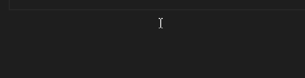

# simpleanimation README

A very simple animation (if can be called so) extension.

## Features

## Requirements
None

## Extension Settings
This extension contributes the following settings:

* `simpleAnimation.enabled`: Enable/disable the animation (without reloading VS Code)
* `simpleAnimation.showDuration`: The duration the animation will stay. (You can use time units, e.g. '2s' for 2 seconds. If no unit is specified, the default unit is milliseconds.)
* `simpleAnimation.changeColor`: Whether change the text color while typing

## Known Issues
None

## Release Notes

### 0.0.1
Initial release
